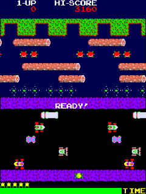
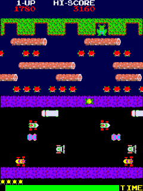
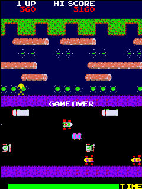
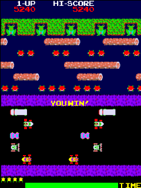
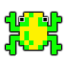
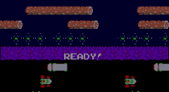

Frogger for KaiOS
=================

HTML5 Canvas-based version of the classic arcade game Frogger, built for [KaiOS](https://kaiostech.com/), forked from [Frogger in Canvas](https://github.com/denodell/frogger).

Frogr is integrated with KaiAds (per [KaiStore Distribution Agreement](https://www.kaiostech.com/sub-agreement/)) and optimized for 240x320 screens.

Adapted from the book "Pro JavaScript Development - Coding, Capabilities and Tooling" by Den Odell, published by Apress, 2014.

### Screenshots 

Ready!  | Game Play |  Game Over  |  You Win!
------ | ------ | ------ | ------
 |  |  |  

### Icons 

### Banner

## Install & run

There is no build process for this app, however, ESLint is used for static analysis.

## Controls

### Keyboard

- ENTER - Pause game, start next level, or restart game after game over
- UP - Move up
- LEFT - Move left
- DOWN - Move down
- RIGHT - Move right

## Technologies

- JavaScript
- Canvas
- KaiOS

## Features:

- Works offline as a privileged app
- Support keyboard
- Performant animations
- Made with Love :)
